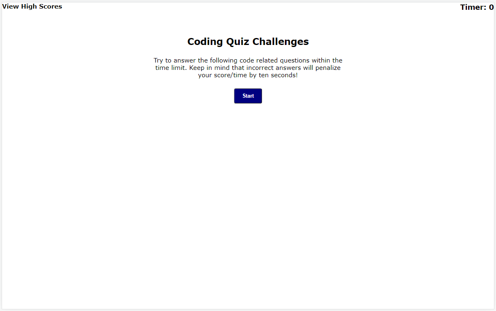
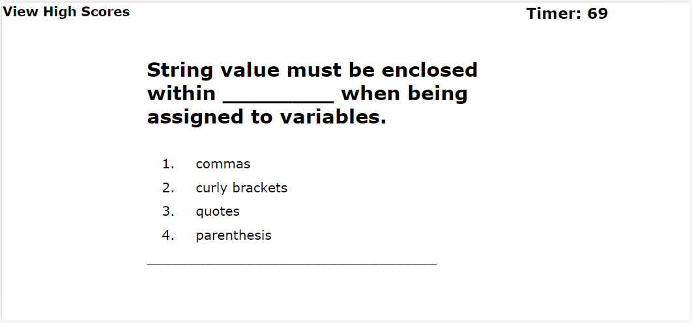
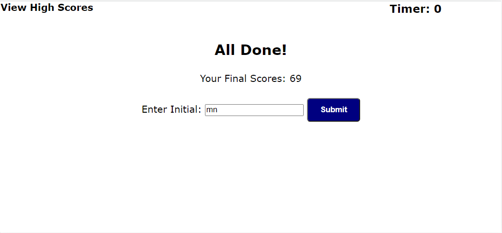
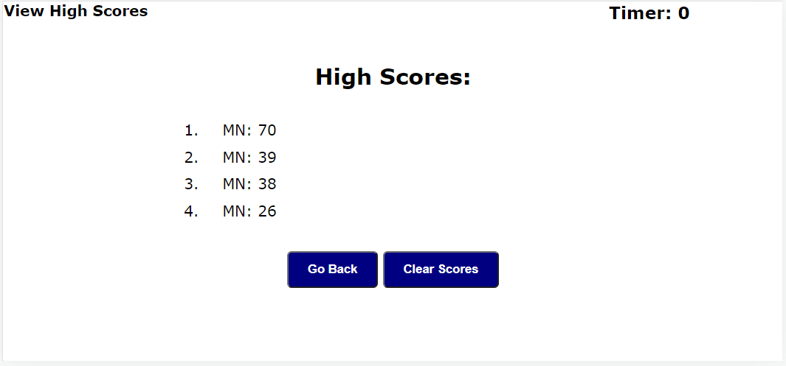

# QuizWeb

Bootcamp Week 4: Homework

# 04 Web APIs: Code Quiz

## About Task

This week’s homework is required to build a timed coding quiz with multiple-choice questions. This app will run in the browser and will feature dynamically updated HTML and CSS powered by JavaScript code without using any libraries. It will have a clean, polished, and responsive user interface.

## User Story

AS A coding boot camp student I WANT to take a timed quiz on JavaScript fundamentals that stores high scores SO THAT I can gauge my progress compared to my peers

## My Solution
  
First, this task goes through 4 main processes how it shows as screens:
 - Start Screen /callStartScreen/ 			
 - Test Screen /callTestScreen/ 			
 - End Screen /callEndScreen/ 			
 - Result Screen /callResultScreen/

The screens are all declared in index.html. To change between screens I use the .hide class and changes it using add()/remove() functions in javaScript file. Here is more detailed information on how the logic flows:

**Start function** sets this task ready. And it shows the start screen and clears local storage. /init function or callStartScreen function/

**Test function** is for the test-taking process. It is the most challenging part of this task.

Timer starts. /startTimer function/ Also the timer is counted as the test score. /var realTimeScore/  

Questions with answer choices are printed on the  screen. /callNextQuestion function/ Then wait for the student to make a choice. /answerList event listener/  

If a student chooses an answer, the choice is compared with a correct answer. Then notify the answer is right/wrong. If the answer is wrong, the score/time    
is deducted by ten seconds!  

Then call the next question and print it to the screen. This process continues until the timer is done or all the questions are answered.

**End function** is called when test-taking process is finished. Here is shown student's final score. Also the student's initial can be saved for future records. It is saved to local storage and object array same time. /submit event listener/

**Result function** shows all the test taker's results on the screen. /renderList function/

The result can be listed from the top score to the lowest score order. /sortMaxToMin function/

If another student wants to give a test, do it again from the start. /start again event listener/

Also, there is a choice you can clear all the records and start the test again. /clear event listener/

## Mock-Up
The following pictures show the completed task's appearance and changes. Beginning of the task:

During test-taking:

When the test is done, gets the student's initial:

Show all student's test score results

## Note

Here is the published page address: https://nara1469.github.io/QuizWeb/
