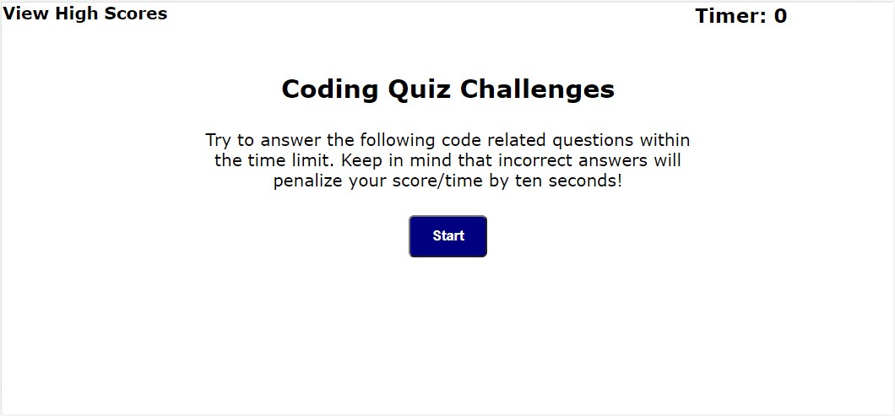

# QuizWeb

Bootcamp Week 4: Homework

# 04 Web APIs: Code Quiz

## About Task

This week’s homework is required to build a timed coding quiz with multiple-choice questions. This app will run in the browser and will feature dynamically updated HTML and CSS powered by JavaScript code without using any libraries. It will have a clean, polished, and responsive user interface.

## User Story

AS A coding boot camp student I WANT to take a timed quiz on JavaScript fundamentals that stores high scores SO THAT I can gauge my progress compared to my peers

## My Solution

First this task flows through 4 main processes how it shown as screens: 
Start Screen 
Test Screen
End Screen
Result Screen

The screens are all declared in index.html. During changing between screens I use the .hide class and changes it using add()/remove() functions in javaScript file.

Start function sets this task ready. Shows the start screen and clears local storage. 

Test function. Timer starts

End function

Result function

## Mock-Up

The following pictures shows the completed task's appearance and and changes. Beginning of the task:

During test taking:

When test is done, gets the student's initial:

Show all student's test score results 

## Note

Here is the published page address: https://nara1469.github.io/QuizWeb/
